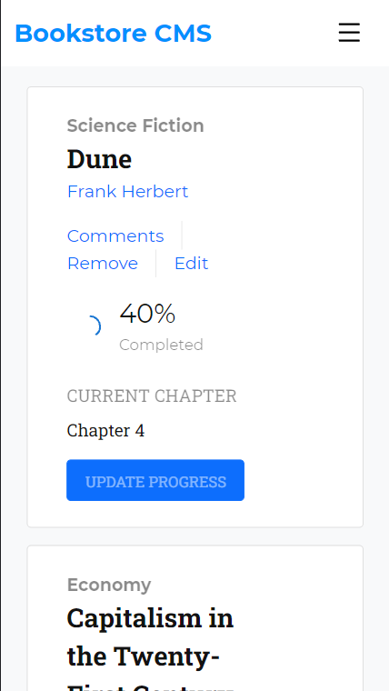

# React-Redux setup

This is a simple yet powerful React-Redux boilerplate for later use as a starting point in other projects. It derives from `create-react-app` with a few modifications, which include installing StyleLint, ESLint, and Bootstrap, removing unimportant files, and adding some content to the remaining files. It features a functional Counter component that implements Redux for state management, using `useSelector` and `useDispatch` hooks.

## Mobile

## Desktop

## Live Demo

[Live Demo Link](https://dicodiaz.me/react-redux-setup/)

## Built With

- React
- Redux
- Bootstrap
- VSCode
- Git & GitHub

## Getting Started

To get React and Redux up and running in another project, follow these simple steps:

1. Clone the repository into your machine (Or download the .zip file and extract).
2. Open the project's folder.
3. Copy and paste all files and folders except app_screenshot.png, app_screenshot-2.png, MIT.md, and README.md into the other project's root folder.
4. Run `npm install`
5. Run `npm start`

### Considerations

- Intended only for use as a starting point in other projects. Do not copy and paste these files into more mature projects as this will overwrite your package.json and package-lock.json files.
- This project also includes Bootstrap for styling.

### Setup

Follow the steps described before.

## Authors

👤 **Dico Diaz Dussan**

- GitHub: [@dicodiaz](https://github.com/dicodiaz)
- Twitter: [@DicoDiaz1](https://twitter.com/DicoDiaz1)
- LinkedIn: [Dico Diaz Dussan](https://www.linkedin.com/in/dico-diaz-dussan-476106a6/)

## 🤝 Contributing

Contributions, issues, and feature requests are welcome!

Feel free to check the [issues page](../../issues/).

## Show your support

Give a ⭐️ if you like this project!

## 📝 License

This project is [MIT](./MIT.md) licensed.
